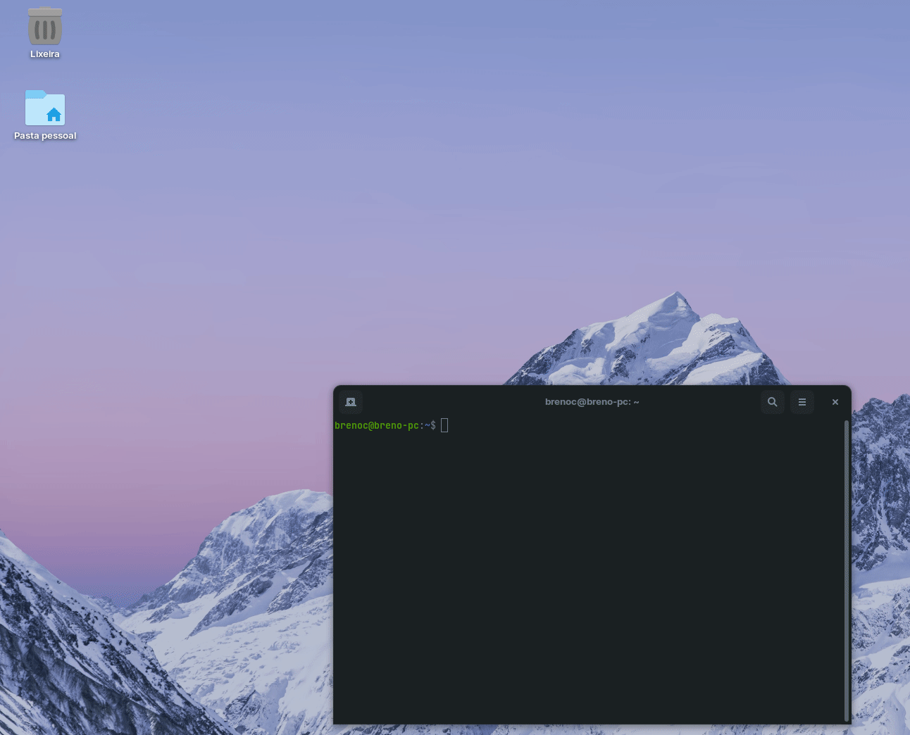

# **Sobre**

Ferramenta para adicionar e deletar dispositivos da rede do Roteador D-Link DIR-610, através do endereço MAC.

<br>

# **Como usar?**

## **1. Instalar dependências**

Primeiramente, para usar a ferramenta é preciso instalar as dependências necessárias para a execução.

<br>

**1. Instalando Python 3**

A base do código é feita totalmente em Python, então para que o mesmo funcione é necessário a instalação do **Python 3** e o gerenciador de pacotes **pip**.

    Importante: Passos serão referentes à instalação em um ambiente Linux através do gerenciador de pacotes.

1. Verifique se já tem o Python instalado, se você usa GNU/Linux, provavelmente já possui alguma versão do Python instalada por padrão. Para conferir, digite em um terminal:

    **```$ which python```**

    ou 

    **```$ which python3```**

    que deve retornar algo como **```/usr/bin/python```** ou **```/usr/bin/python3```**. Isso significa que o Python está instalado nesse endereço.

    <br>

2. Os gerenciadores de pacotes mais comuns são apt-get (Debian, Ubuntu) e yum (RedHat, CentOS). Caso sua distribuição utilize um gerenciador de pacotes diferente, acesse a [página de downloads do Python](https://www.python.org/downloads/).
   
   **Apt-get**

    Para instalar o Python 3, digite em um terminal:

    **```$ sudo apt-get install python3```**

    Para instalar o gerenciador de pacotes pip, digite em um terminal:

    **```$ sudo apt-get install python3-pip```**

    <br>

    **Yum**

    Para instalar o Python 3, digite em um terminal:

    **```$ sudo yum install python3```**

    Para instalar o gerenciador de pacotes pip, digite em um terminal:

    **```$ yum -y install python3-pip```**

<br>

**2. Instalando Selenium**

Além do Python 3, é de grande importância a instalação das dependências do Selenium, para a comunicação da ferramenta com o navegador.

    Importante: A ferramenta é compatível e funcionará apenas no Navegador Web Firefox.

    Em breve suporte para outros navegadores.

<br>

    Importante: Não apague o arquivo Driver "geckodriver"!

    Ele necessário para a integração do Selenium com o Navegador. 

1. Se você tiver pip em seu sistema, pode simplesmente instalar ou atualizar as ligações Python:

    **```$ pip install selenium```**

    ou

    **```$ pip install -U selenium```**

    
    <br>


## **2. Iniciar a ferramenta**

Agora com tudo instalado pode-se de iniciar o programa com o seguinte comando:

**```$ python wipy.py```**

ou

**```$ python3 wipy.py```**



Também é possível fazer a criação de um **alias** em ambientes Linux, assim facilitando a execução do programa. Para isso usa-se o seguinte comando:

**```$ alias [Nome do alias]="[Comando bash entre aspas.]"```**

**Ex.:** 

**```$ alias wipy="python3 wipy.py"```**

Agora basta usar o **alias** para executar o programa.

**```$ wipy```**
